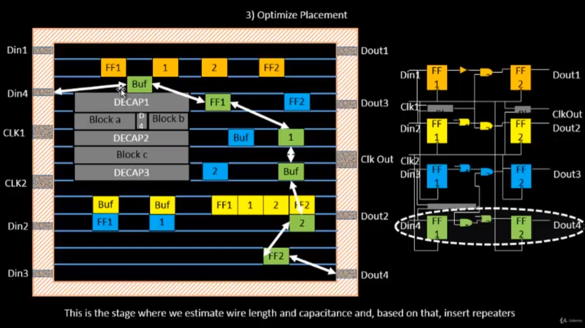
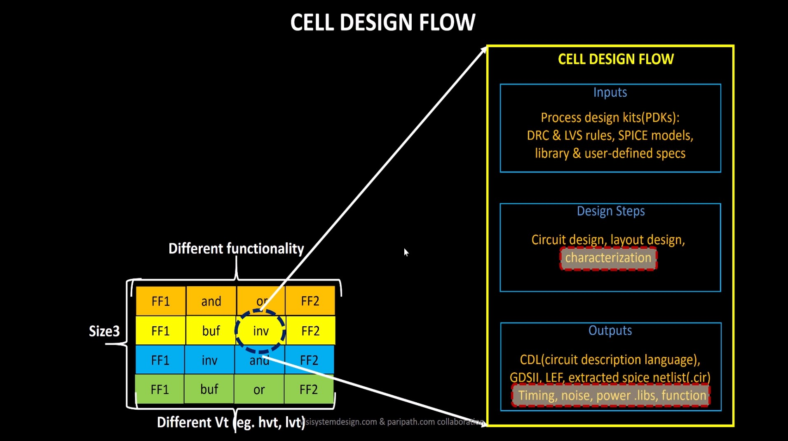
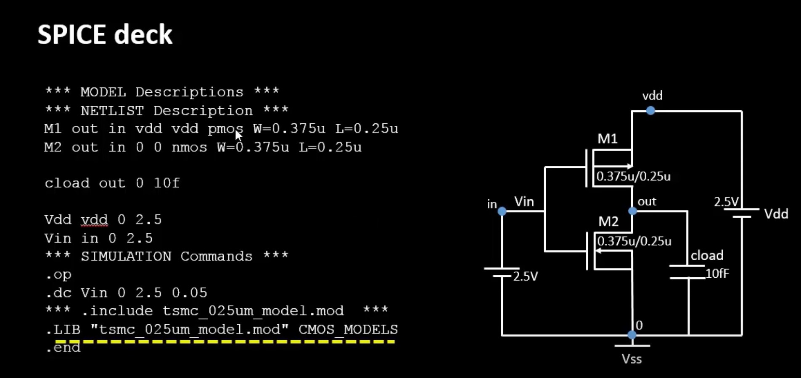
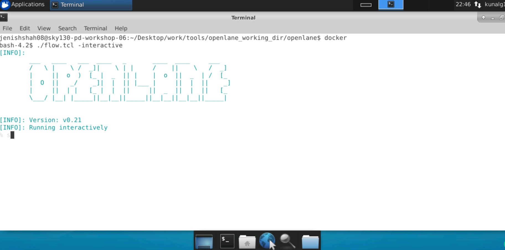
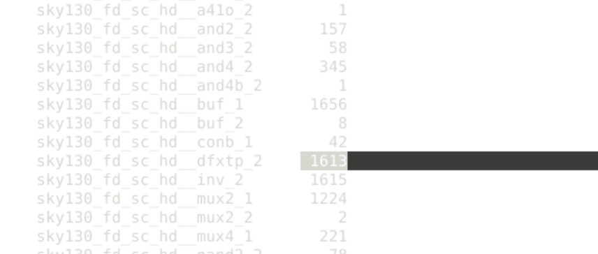
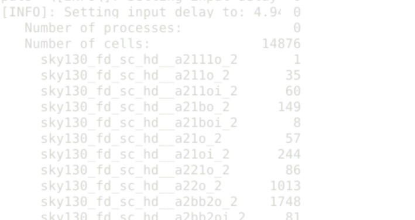
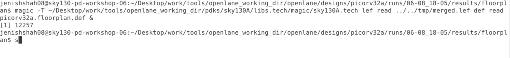
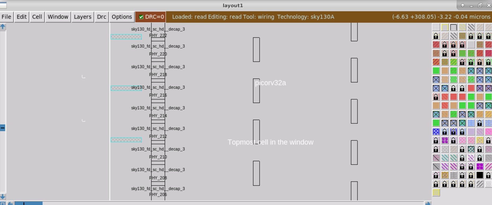
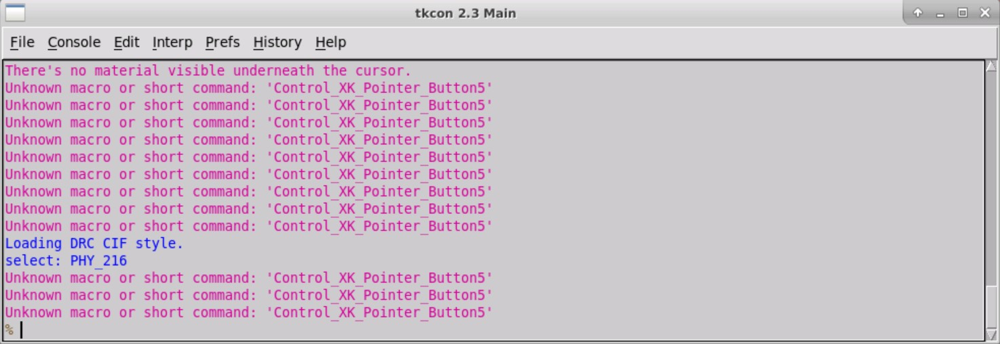

# Advanced-Physical-Design-Workshop
Using Sky130 and OpenLane

### Useful Links:

* https://vsdiat.com/
* https://www.vlsisystemdesign.com/vsd-iat/
* https://www.udemy.com/course/vsd-a-complete-guide-to-install-openlane-and-sky130nm-pdk/
* https://www.udemy.com/course/vsd-a-complete-guide-to-install-open-source-eda-tools/
* https://github.com/Geetima2021/vsdpcvrd

## Introduction

### For end-to-end ASIC development:

#### RTL Designs

Open source options:

* librecores.org
* opencores.org
* github.com
* personal RTL

#### PDK Data

The first and most popular open source option is SKY130

* Only US-owned pure-play Silicon Foundry
* Sponsored by Google
* Latest: SKY90 announced

#### EDA Tools

Open source options:

* Qflow
* OpenROAD
* OpenLANE (from efabless.com) with support for SKY130, XFAB180, GF130G.

### RTL to GDSII:

1. Synthesis (using the Standard Cell Library)
2. Floor and Power Planning
3. Placement
4. Clock Tree Synthesis
5. Routing
6. Sign-off
* Physical Verification
* Timing Verification (STA)

## Floor and Power Planning

#### It is the arrangement of IPs and pre-placed cells in a chip.

#### Utilization Factor = (Area occupied by Netlist) / (Total Area of the core)

#### Aspect Ratio = (H of core) / (W of core)

#### Core is in the Die.

#### Surround pre-placed cells with decoupling capacitors.

#### Power Planning:

Multiple Vdd and Vss in a mesh to avoid ground bounce and voltage droop.

#### Pin Placement:

Placing i/o pins in the area between core and die and then logical cell placment blockage for the remaining area.

#### Placement:

1. Bind netlist with physical cells from library

2. Placement on the floorplan

3. Optimize placement: we estimate wire length & capacitance and, based on that, insert repeaters/buffer to maintain signal integrity.

#### Cell Design Flow:

Library has standard cells with different functionalities, sizes and voltages.

#### Charaterization:

* GUNA software
* Timing Characterization
* Propogation delay = time(out_*_thr) - time(int_*_thr)
* *Transition Time = time(slew_high_*_thr) - time()slew_low_*_thr)
*   *= rise/fall

## Labs

openlane$ docker

bash -4.2$ ./flow.tcl -interactive

% package require openlane 0.9

% prep -design picorv32a

% run_synthesis

Number of D Flip Flops = 1613

Number of cells = 14876

% run_floorplan

#### Magic:

% run_placement
